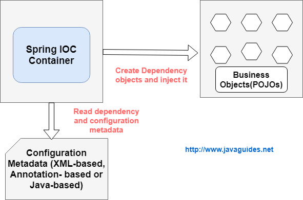
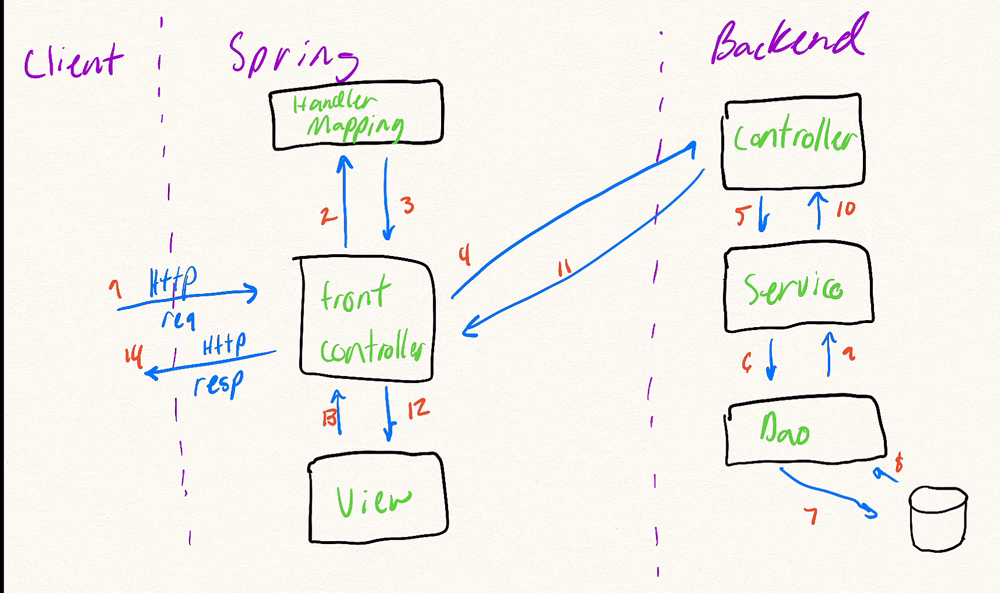

# Introduction to Spring
Spring is a massive framework that offers a ton of features. To help organize and modularize things, Spring has segregated multiple features into individual sections. This allows developers to pick and choose only what they need, reducing the bulk of their projects.

## Example Spring Modules
- Spring Framework
- Spring Boot
- Spring MVC
- Spring Data
- Spring Data JPA
- Spring AOP
- Etc.

## Spring Framework
Most Spring sections utilize the Spring framework to perform their operations.

### Inversion of Control (IoC)
A design principle in which we let a program or container take care of the control flow for our application rather than following the traditional approach of manually handling it. This allows developers to focus on building features rather than managing dependencies.

**Analogy:** Instead of driving to a destination yourself, it's like using Uber, public transportation, or a self-driving car.

### Dependency Injection (DI)
IoC is a concept (design principle), while DI is a design pattern that implements IoC specifically for our objects. Since we remove the control of creating new objects manually, we can use DI to indicate that one object depends on another object. The Spring framework detects these relationships and injects the required dependencies automatically.

**Benefits:**
- Developers can focus on functionality rather than constantly creating and passing objects.
- The Spring framework handles object creation and injection.

## Spring IoC Container
This container is responsible for instantiating, managing, and assembling objects. Any object created and managed by the IoC container is called a **Spring Bean**. You can configure these beans in various ways to tailor their behavior.



## ApplicationContext vs BeanFactory
Spring comes with two types of IoC containers:

### BeanFactory
- Lazily instantiates beans (only when needed).
- Requires a `beans.xml` for configuration.
- Memory-friendly for extremely resource-constrained environments.

### ApplicationContext
- Eagerly instantiates beans by default.
- Extends BeanFactory by adding advanced features (e.g., annotation configuration).
- Provides enterprise-level functionalities.

**General Rule:** Use ApplicationContext unless there's a specific need for BeanFactory's lower memory footprint.

## Spring Bean
### Bean Scope
1. **Singleton** (Default): A single bean instance is created and shared.
2. **Prototype**: A new bean instance is created every time it’s requested.
3. **Web-Aware Scopes**:
   - Request Scope: A new bean for each HTTP request.
   - Session Scope: A new bean for each HTTP session.
   - WebSocket Scope: A new bean for each WebSocket session.
   - Application Scope: A new bean for the servlet lifecycle.

## Lifecycle of a Bean
1. **Bean Creation**:
   - Instantiation via constructor.
   - Dependencies are injected.
   - Spring assigns a name.
   - A custom initialization method can be called.
   - The bean is ready for use.
2. **Bean Destruction**:
   - The IoC container marks the bean as no longer needed.
   - A custom destroy method can be called.
   - Garbage collection eventually reclaims the memory.

## Annotation vs XML-based Spring Application

### XML-based Configuration
- Utilizes `beans.xml`.
- Centralizes bean configuration.
- The older way of setting up beans.

### Annotation-based Configuration
- Uses annotations to declare and configure beans.
- **`@Component`**: Declares the class as a bean.
- **`@Scope`**: Defines the bean scope.
- **`@Autowired`**: Injects a bean (field, setter, or constructor).
- **`@Qualifier`**: Identifies a bean by name for injection.
- **`@Configuration`**: Declares a class for bean configuration.

## Spring Stereotypes
- **`@Component`**: A generic Spring-managed bean.
- **`@Repository`**: Indicates a data access object (DAO) that interacts with the DB.
- **`@Service`**: Indicates a service layer component.
- **`@Controller`**, **`@RestController`**: Marks a controller component (for handling web requests).

## Spring Data
Spring Data consolidates and simplifies database interactions, providing multiple options to integrate with various data sources.

### Spring Data JPA
- **JPA** (Java Persistence API) is a specification from Java EE 6; Spring made its own version.
- Provides ready-made classes and interfaces for straightforward DB operations.
- Uses `application.yml` to specify the database connection details.

#### Spring JPA Repository Useful Annotations
- **@Entity**: Maps a Java class to a database table.
- **@Table**: Specifies the table name and, optionally, schema details.
- **@Id**: Declares the primary key field of the entity.
- **@GeneratedValue**: Configures how the primary key is generated (e.g., IDENTITY, SEQUENCE).
- **@Column**: Customizes the mapping of a field to a database column (e.g., name, length, nullability).
- **@OneToMany, @ManyToOne, @OneToOne, @ManyToMany**: Define relationships between entities.
- **@JoinColumn**: Specifies the foreign key column for an association.
- **@JoinTable**: Used with @ManyToMany to define the intermediary join table.
- **@Transient**: Marks a field that should not be persisted in the database.
- **@Embeddable** and **@Embedded**: Used to embed value objects into an entity.

**Additional annotations (often Hibernate-specific):**

- **@CreationTimestamp** and **@UpdateTimestamp**: Automatically populate timestamp fields for creation and updates.

#### Entity Relationships:

#### 1. One-to-One Relationship

**Example:** A Person has one Passport.

```java
@Entity
public class Person {
    @Id
    @GeneratedValue(strategy = GenerationType.IDENTITY)
    private Long id;
  
    @OneToOne(cascade = CascadeType.ALL)
    @JoinColumn(name = "passport_id", referencedColumnName = "id")
    private Passport passport;
}

@Entity
public class Passport {
    @Id
    @GeneratedValue(strategy = GenerationType.IDENTITY)
    private Long id;
  
    @OneToOne(mappedBy = "passport")
    private Person person;
}
```

*Explanation:*  
- **Person** is the owning side using `@JoinColumn` to hold the foreign key.
- **Passport** is the inverse side, indicated by `mappedBy`.

---

#### 2. One-to-Many Relationship

**Example:** A Department has many Employees.

```java
@Entity
public class Department {
    @Id
    @GeneratedValue(strategy = GenerationType.IDENTITY)
    private Long id;
  
    @OneToMany(mappedBy = "department", cascade = CascadeType.ALL)
    private List<Employee> employees = new ArrayList<>();
}

@Entity
public class Employee {
    @Id
    @GeneratedValue(strategy = GenerationType.IDENTITY)
    private Long id;
  
    @ManyToOne
    @JoinColumn(name = "department_id")
    private Department department;
}
```

*Explanation:*  
- **Department** is the inverse side with a collection of Employees.
- **Employee** is the owning side with a foreign key (`department_id`) linking back to Department.

---

#### 3. Many-to-Many Relationship

**Example:** Students and Courses, where a Student can enroll in many Courses and a Course can have many Students.

```java
@Entity
public class Student {
    @Id
    @GeneratedValue(strategy = GenerationType.IDENTITY)
    private Long id;
  
    @ManyToMany(cascade = CascadeType.ALL)
    @JoinTable(
        name = "student_course",
        joinColumns = @JoinColumn(name = "student_id"),
        inverseJoinColumns = @JoinColumn(name = "course_id")
    )
    private Set<Course> courses = new HashSet<>();
}

@Entity
public class Course {
    @Id
    @GeneratedValue(strategy = GenerationType.IDENTITY)
    private Long id;
  
    @ManyToMany(mappedBy = "courses")
    private Set<Student> students = new HashSet<>();
}
```

*Explanation:*  
- The **Student** entity owns the relationship and defines a join table.
- The **Course** entity is the inverse side using `mappedBy` to refer to the field in Student.

### What is an ORM?
- Stands for Object-Relational Mapper.
- Automates SQL generation, maps DB records to Java objects, and handles connections.
- Spring Data primarily uses **Hibernate** as its ORM.
- Hibernate Auto DDL (Development Only)
   - The spring.jpa.hibernate.ddl-auto property controls Hibernate's schema generation behavior.
   - The different possible values are:
      - create: Drops and recreates the schema on each startup
      - create-drop: Creates the schema on startup and drops it on shutdown
      - update: Updates the schema if necessary and doesn't drop existing tables
      - validate: Validates the schema but makes no changes
      - none: Disables DDL handling

## Spring Boot
- Simplifies project setup and configuration.
- Eliminates most boilerplate and XML configurations.
- Provides enterprise-ready features out of the box.
- Relies on the Spring Framework under the hood.

## Transactional Propagation
Used with the **`@Transactional`** annotation:
- **Propagation.REQUIRED**: Creates a new transaction if none exists.
- **Propagation.NEVER**: Does not run in a transaction and throws an exception if one is already active.

## Spring MVC
Built around the **Model-View-Controller** pattern to handle web applications.

### Spring MVC Architecture:


### Spring MVC Annotations
- **`@RequestMapping`**: Used to expose a resource or data from the DB via a web endpoint.
  - **`method`**: Determines which HTTP verb (GET, POST, etc.) the endpoint listens for.
  - **`value`**: Defines the URI path.
  - **`consumes`**: Specifies the expected input format (JSON, XML, etc.).
  - **`produces`**: Specifies the output format sent back to the client.
- **`@RestController`**: Specialized controller for REST APIs.
- **`@GetMapping`, `@PostMapping`, `@PutMapping`, `@DeleteMapping`**: Shortcut annotations for `@RequestMapping` for specific HTTP verbs.
- **`@PathVariable`**: Binds a URI template variable to a method parameter.
- **`@ResponseBody`**: Indicates what the method returns is the response body.
- **`@ResponseStatus`**: Specifies the HTTP status code that should be returned.
- **`@ExceptionHandler`**: Sends custom responses when specific exceptions occur in a controller method.

## Spring Boot Actuator
Provides endpoints for monitoring and metrics:
- **`/health`**: Shows application health info.
- **`/beans`**: Lists available beans.
- **Other**: `/env`, `/info`, `/logfile`, `/loggers`, `/mappings`, `/metrics`, etc.

## Spring Boot Profiles
Allows environment-specific configurations (dev, test, prod). Use **`@Profile("envName")`** to map beans to a profile.

## Spring Boot DevTools
- Disables caching to speed up development.
- Enables automatic restarts for faster workflow.